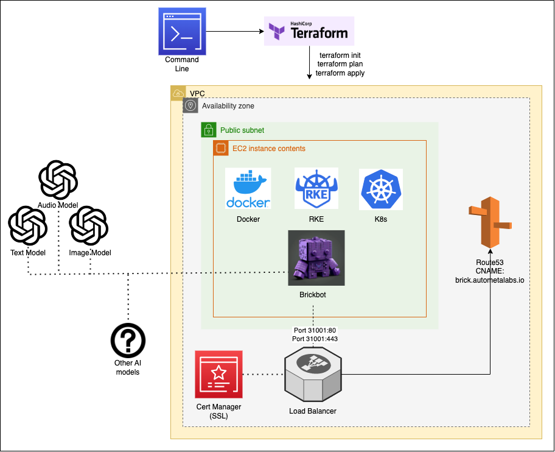

# brickbot

# Brickbot - All-in-One AI Interface

Welcome to the Brickbot repository, your AI-driven assistant designed to interact with a variety of AI models. This README provides essential information about the project's infrastructure and deployment tools. Brickbot is a highly available and scalable platform built using React and runs on a state-of-the-art infrastructure powered by Amazon Web Services (AWS).

## Table of Contents

1. [Introduction](#introduction)
2. [Infrastructure Diagram](#infrastructure-diagram)
3. [Deployment Tools](#deployment-tools)
4. [Conclusion](#Conclusion)

## Introduction

Brickbot is a user-friendly interface designed to interact with various AI models such as text, speech-to-text, and image processing. It runs on an advanced infrastructure using AWS services to ensure high availability, scalability, and robust performance. The primary goal is to provide users with a seamless experience while interacting with AI models and the possibility to expand the application by connecting to other AI engines in the future.

## Infrastructure Diagram

The diagram above showcases the main components of the Brickbot infrastructure:

| Component                | Description                                                |
|--------------------------|------------------------------------------------------------|
| EC2 Instance             | Virtual server that hosts the Kubernetes cluster.         |
| Network Load Balancer (NLB) | Balances traffic across multiple instances to ensure optimal performance. |
| Resource Group           | A logical container for resources within an AWS account.  |
| Security Group           | Controls inbound and outbound traffic for the associated resources. |
| Route 53 Record          | DNS record that routes traffic to the application.        |

Brickbot runs on port `31001`, while the NLB exposes the app through port forwarding on ports `80` and `443`. It also has an SSL certificate from AWS Certificate Manager.

## Deployment Tools

The following tools were used to create and deploy Brickbot:

| Tool                     | Description                                                |
|--------------------------|------------------------------------------------------------|
| Terraform                | Infrastructure as Code (IaC) tool used to create the AWS infrastructure. State is stored in an S3 bucket. |
| RKE (Rancher Kubernetes Engine) | CLI tool used to create the Kubernetes cluster on the EC2 instances. |
| React                    | A popular JavaScript library for building the user interface of the Brickbot application. |

These tools work together to create a robust and scalable infrastructure for the Brickbot application, allowing it to efficiently interact with the OpenAI API models and potentially connect to other AI engines in the future.

## Conclusion

In this extraordinary journey of exploring the vast capabilities of artificial intelligence, Brickbot stands as a testament to human innovation and the potential of AI in enhancing our daily lives. By leveraging the power of AWS, Kubernetes, and React, Brickbot aims to provide a seamless experience for users to interact with AI models and explore the limitless possibilities they present.

As you delve into the realms of Brickbot, remember that the true power of AI lies not only in the technology itself but in the creative and inspiring ways in which it can
